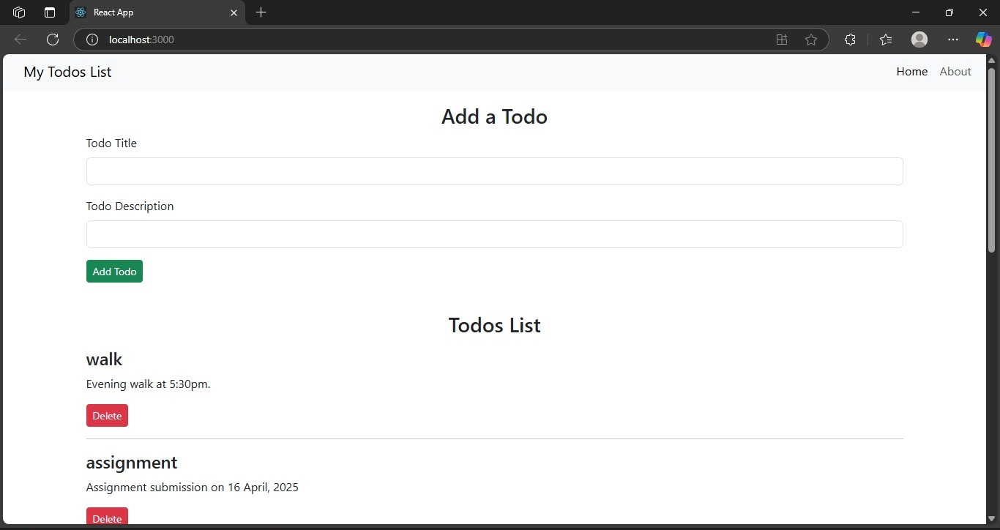

# 📝 React Todo App

A simple Todo app built with **React** to practice and revise core React concepts like components, props, state, and routing.

## 🚀 Features

- ✅ Add todos (title + description)
- 🗑️ Delete todos
- ⚠️ Validation: title & description cannot be blank
- 📄 About page
- ⚛️ React Router setup for routing

  
## 💡 How to Run Locally

1. Clone the repo:
   ```bash
   git clone https://github.com/your-username/your-repo-name.git

2. Install dependencies:
    ```bash
    npm install

3. Start the dev server
    ```bash
    npm start

4. Open in Browser
   ```arduino
   http://localhost:3000


🛠 Tech Stack
- React
- React Router
- JavaScript
- HTML/CSS



